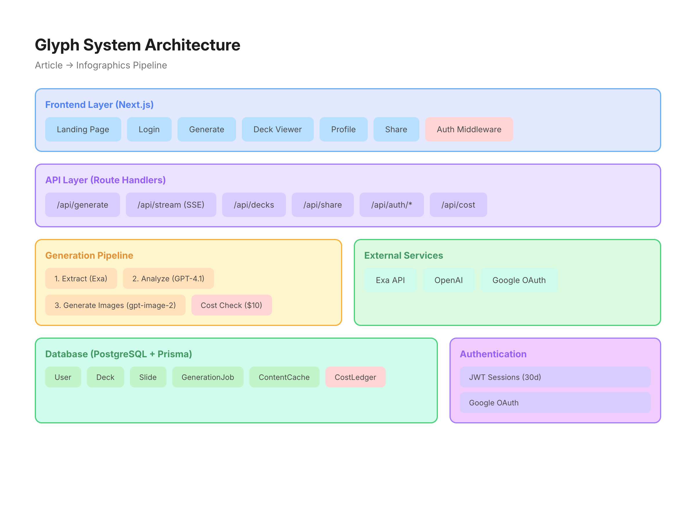
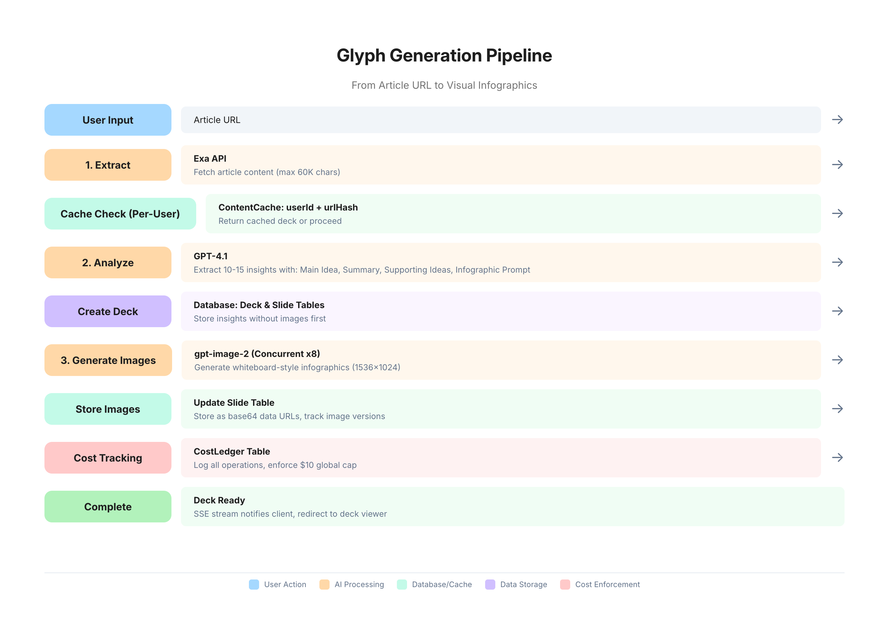

# Glyph — Turn Articles into Visual Infographics

Paste a URL and get AI-generated whiteboard-style infographic slides in seconds. Powered by GPT-4.1 + gpt-image-2.

## Tech Stack

- **Framework**: Next.js 15.5.18 with App Router
- **Database**: PostgreSQL with Prisma ORM
- **Auth**: Custom Google OAuth with JWT sessions (jose)
- **AI Services**: 
  - Exa (content extraction)
  - OpenAI GPT-4.1 (insight extraction)
  - OpenAI gpt-image-2 (infographic generation)
- **Styling**: Tailwind CSS 4
- **Deployment**: Railway

## System Architecture



## Generation Pipeline



## Database Schema

### Core Models

**User**
- id, email, name, image, emailVerified, createdAt
- Relations: accounts, sessions, decks, generationJobs, costLedger

**Deck**
- id, userId, title, sourceUrl, shareId, isPublished, publishedAt
- exaRaw (JSON), quality (low/medium/high), createdAt, updatedAt
- Relations: user, slides, generationJobs, costLedger

**Slide**
- id, deckId, position, mainIdea, summary (Text)
- supportingIdeas (JSON), infographicPrompt (Text)
- imageUrl, imageVersions (JSON), stylePreset
- createdAt, updatedAt
- Relations: deck, costLedger

**GenerationJob**
- id, userId, deckId, sourceUrl
- status (queued/extracting/analyzing/generating_images/complete/failed)
- progress (JSON), error
- createdAt, completedAt
- Relations: user, deck

**ContentCache**
- id, urlHash (unique), url, exaResponse (JSON)
- createdAt, expiresAt

**CostLedger**
- id, userId, deckId, slideId
- service (exa/gpt-5.5/gpt-image-2)
- operation (extract/insights/image_gen/regenerate)
- estimatedCost (Decimal)
- createdAt
- Relations: user, deck, slide

### OAuth Models (NextAuth-compatible)
- Account, Session, VerificationToken

## Core Pipeline

The generation flow in `src/lib/pipeline.ts`:

1. **Extract** → Exa API fetches article content (truncated to 60K chars)
2. **Analyze** → GPT-4.1 extracts 10-15 insights with detailed prompts
3. **Generate Images** → gpt-image-2 creates whiteboard-style infographics (concurrent, max 8)
4. **Cost Tracking** → All operations logged to CostLedger, enforces $10 global cap

## API Routes

| Route | Method | Description |
|-------|--------|-------------|
| `/api/generate` | POST | Create generation job |
| `/api/generate/[jobId]/stream` | GET | SSE stream for real-time progress |
| `/api/decks/[id]` | GET | Fetch deck with slides |
| `/api/decks/[id]/publish` | POST | Publish deck with share ID |
| `/api/profile/decks` | GET | List user's decks |
| `/api/share/[id]` | GET | Public access to published decks |
| `/api/cost` | GET | Return spending status |
| `/api/auth/signin` | GET | Initiate Google OAuth |
| `/api/auth/callback/google` | GET | OAuth callback |
| `/api/auth/signout` | POST | Sign out |
| `/api/auth/session` | GET | Get current session |

## Pages

- **/** - Landing page with URL input
- **/login** - Google OAuth button
- **/generate** - Progress page with SSE streaming
- **/deck/[id]** - Deck viewer with sidebar navigation
- **/profile** - User's deck grid (published vs drafts)
- **/s/[id]** - Public shared deck view (no auth required)

## Authentication

Custom Google OAuth implementation (not NextAuth.js library):
- JWT-based sessions with 30-day expiration
- State parameter validation for CSRF protection
- Middleware protects routes except `/api/auth`, `/api/share`, `/login`, `/s/`

## Key Features

- Real-time generation progress via SSE
- Whiteboard-style infographic generation with detailed prompts
- Keyboard navigation (arrow keys)
- Draft vs published deck management
- Shareable public links
- Global spending cap enforcement ($100)
- Content caching to avoid duplicate Exa calls

## Getting Started

```bash
npm install
npm run dev
```

Open [http://localhost:3000](http://localhost:3000)

## Environment Variables

- `DATABASE_URL` - PostgreSQL connection
- `AUTH_URL` - Base URL for OAuth callbacks
- `AUTH_SECRET` - JWT signing secret
- `GOOGLE_CLIENT_ID`, `GOOGLE_CLIENT_SECRET` - OAuth credentials
- `EXA_API_KEY` - Exa search API
- `OPENAI_API_KEY` - OpenAI API
